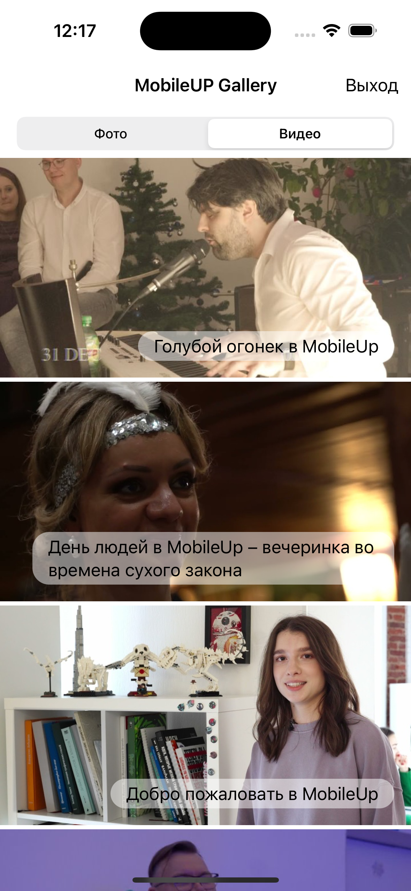

# MobileUp gallery (test case/ Demichev Mikhail)
## Декомпозиция задач проекта
Актуальный статус по времени и проекту в целом можно посмотреть В Notion по ссылке:

https://www.notion.so/MobileUp-gallery-test-case-Demichev-Mikhail-9c0c2cfb3c6b45ff899a21f2a39d928d

  

# Использованный стэк технологий:
- Язык: Swift5, Xcode
- Фреймворки: SwiftUI, UIKit, Network, Wbkit, Combine
- Архитектура: MVVM 
- Ui, дизайн, верстка: Figma
- Функционал приложения - ТЗ
- Данные приложения: VK API

# Обзор проекта
## Экран логина
При нажатии на кнопку приложение проверяет интернет-соединение и редиректит на WebView авторизации ВК.
После авторизации пользователь получает токен и перенаправляется на главную страницу приложения.

  
  
  

## Главный экран приложения
Кнопка выход стирает токен и возвращает на первый экран.
к сожалению по причине долгой модерации от ВК мое приложение, по независящим от меня причинам не получает токен с правами доступа к видео)
Поэтому в скринах прикрепил отображение фото галлереи и мок сборку отображения видео.
При нажатие на любой элемент галлереи отображается окно детального просмотра

  
  
  

## Экран "Детального просмотра" для медиа
Кнопка назад - возвращает обратно в галлерею, кнопка Share - позволяет взаимодейстовать с файлом

  

## Экран "Share" для медиа

  

